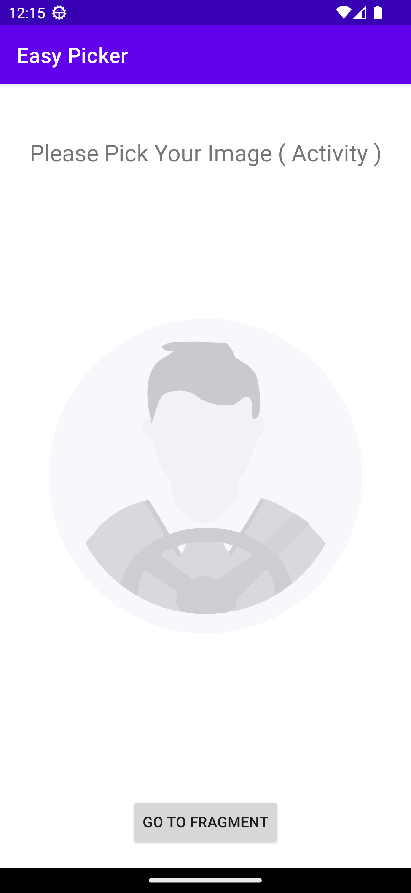
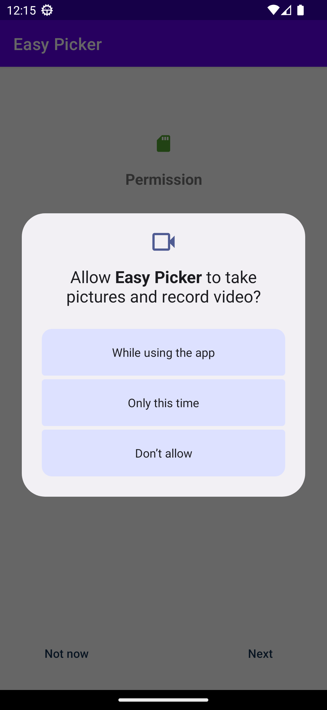
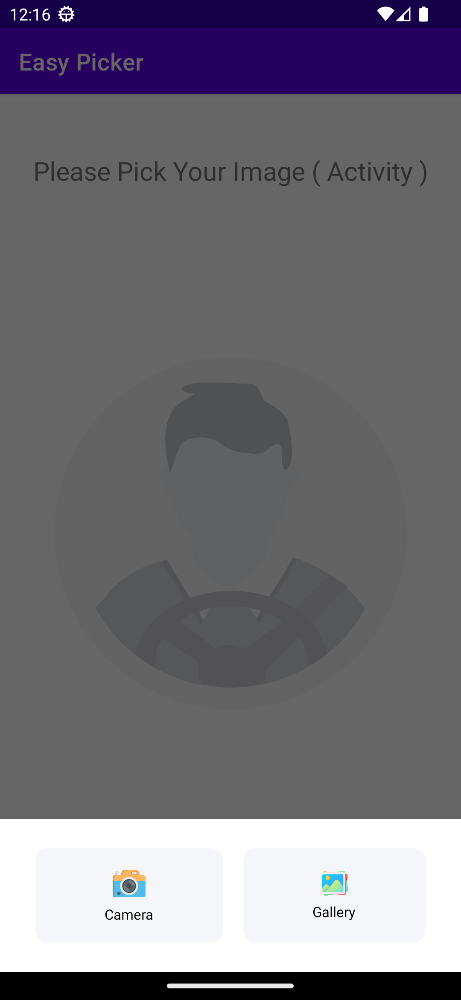
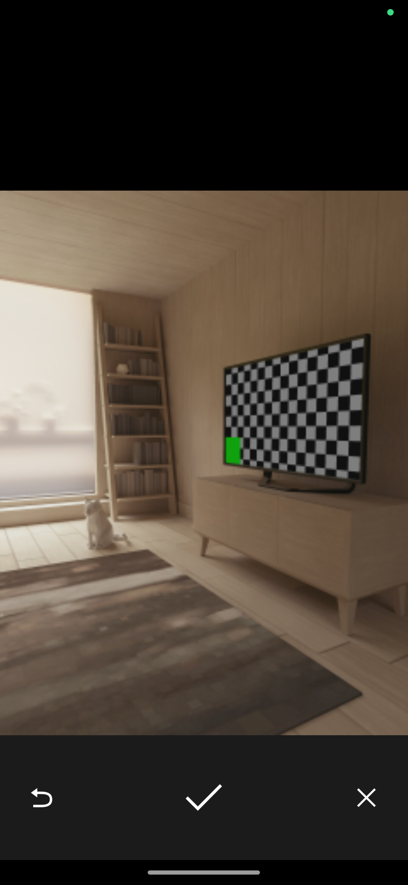
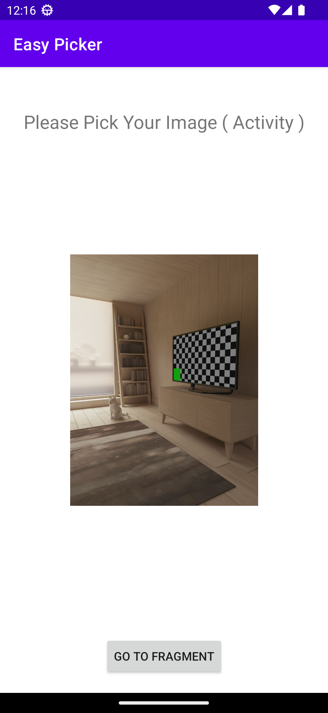

# EasyMediaPicker
Anroid library handling media picker from camera and gallery

- Select Image From Gallery
- Capture Image From Gallery
- Select Video From Gallery
- Select File From Storage
- We can using this library for compressing images in android (befor upload it to server)
- Compressing Image in small sizes without losing image quality 


From Activity             |  From Fragment           |  Take Permissions           
:-------------------------:|:-------------------------: |:-------------------------:
  |    |   

 Customize Your Component      |  Capture Image      |  Easy Getting Media Path
|:-------------------------:|:-------------------------: |:-------------------------:
   |    |  


# Download
--------
Gradle:

```gradle
repositories {
   maven { url 'https://jitpack.io' }
}

build.gradle (app)

  android {
   .
   .
   .
   .

    // for solving Problem duplicate class androidx.lifecycle.viewmodel found in modules add this 
    // add this only if you import the same version of lifecycle viewmodel in easypicker
    configurations {
         all {
               exclude group: 'androidx.lifecycle', module: 'lifecycle-viewmodel-ktx'
           }
       }
    }

dependencies {
	        implementation 'com.github.BasemNasr:EasyMediaPicker:v0.0.6'
}
```


# Easy Way To Using Library
```kotlin
class MainActivity : AppCompatActivity(), OnCaptureMedia {
    private lateinit var easyPicker: EasyPicker
    var mProfileImagePath = ""
    .
    .
    .
    
    override fun onCreate(savedInstanceState: Bundle?) {
       .
       setUpImagePicker()
       btn.setOnClickListener {
            easyPicker.chooseImage()
       }
    }
    
    private fun setUpImagePicker() {
      easyPicker = EasyPicker.Builder(this@MainActivity)
                .setRequestCode(PICK_PROFILE_IMAGE)
                .setIconsAndTextColor(R.drawable.camera,R.drawable.gallery,R.color.black)
                .setSheetBackgroundColor(R.color.white)
                .setListener(this@MainActivity)
                .build()
    }
    
   override fun onCaptureMedia(request: Int, file: FileResource) {
        when (request) {
            PICK_PROFILE_IMAGE -> {
               // getting file path (file.path)
          
                val imagePath = if (file.path!!.isNotEmpty()) {
                    UploadImages.resizeAndCompressImageBeforeSend(
                        this@MainActivity, file.path, File(file.path).name
                    )
                } else file.path

                mProfileImagePath = imagePath!!
                Glide.with(this@MainActivity).load(mProfileImagePath)
                    .into(findViewById<AppCompatImageView>(R.id.ivCaptainProfileImg))
            }
        }
    }
    
}

```
 
# Other Features
```kotlin
  
  // choose image
  easyPicker.chooseImage()
  
 // choose And Compress Image
  easyPicker.chooseAndCompressImage()
  
   // choose Video From Gallery
  easyPicker.chooseVideo()
  
  //choose file and getting file path
    easyPicker.chooseFile()


```


Pull requests are the best way to propose changes to the codebase (we use [Github Flow](https://guides.github.com/introduction/flow/index.html)). We actively welcome your pull requests:

1. Fork the repository and create your branch from `master`.
2. If you've added code that should be tested, add tests.
3. If you've changed APIs, update the documentation.
4. Ensure the test suite passes.
5. Make sure your code lints.
6. Issue that pull request!
7. Always add a `README` and/or `requirements.txt` to your added code.

## Report bugs using Github's [issues](https://github.com/BasemNasr/EasyMediaPicker/issues)
We use GitHub issues to track public bugs. Report a bug by opening a new issue it's that easy!

*Great Bug Reports* tend to have:

- A quick summary and/or background
- Steps to reproduce
    - Be specific!
    - Give sample code if you can.
- What you expected would happen
- What actually happens
- Notes (possibly including why you think this might be happening, or stuff you tried that didn't work)

People love thorough bug reports. I'm not even kidding.


