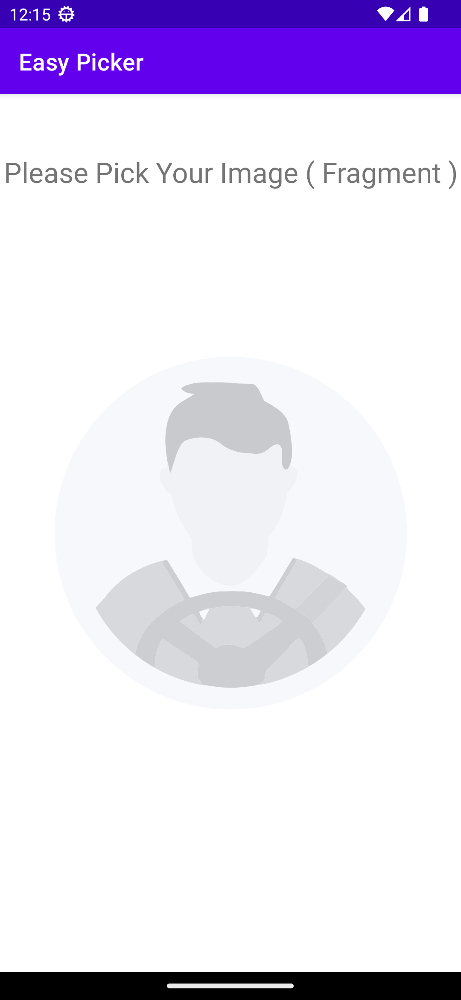

# EasyMediaPicker KMP

A Kotlin Multiplatform library for picking images, videos, and files across Android, iOS, Desktop, and Web platforms.

## Overview

EasyMediaPicker KMP is the multiplatform evolution of [EasyMediaPicker](https://github.com/BasemNasr/EasyMediaPicker). It provides a unified, coroutine-based API for media picking operations across all supported platforms.

### Android Screenshots

From Activity             |  From Fragment           |  Take Permissions           
:-------------------------:|:-------------------------: |:-------------------------:
  |    |   

Customize Your Component      |  Capture Image      |  Easy Getting Media Path
|:-------------------------:|:-------------------------: |:-------------------------:
  |    |  

Multi Choose Images     
|:-------------------------:|


### Features

| Feature | Android | iOS | Desktop | Web |
|---------|---------|-----|---------|-----|
| Pick Image | ✅ | ✅ | ✅ | ✅ |
| Pick Multiple Images | ✅ | ✅ | ✅ | ✅ |
| Pick Video | ✅ | ✅ | ✅ | ✅ |
| Pick Multiple Videos | ✅ | ✅ | ✅ | ✅ |
| Pick File | ✅ | ✅ | ✅ | ✅ |
| Pick Multiple Files | ✅ | ✅ | ✅ | ✅ |
| Camera Capture (Photo) | ✅ | ✅ | ❌ | ✅* |
| Camera Capture (Video) | ✅ | ✅ | ❌ | ✅* |
| Permission Handling | ✅ | ✅ | N/A | N/A |
| Compose Integration | ✅ | ✅ | ✅ | ✅ |

*Camera capture on web uses the browser's built-in camera interface via `capture` attribute.

## Installation

### Option 1: Maven Central (Recommended - Supports Android, iOS, Desktop, Web)

Add the dependency to your **shared module**'s `build.gradle.kts`:

```kotlin
// In your shared module (e.g., composeApp or shared)
kotlin {
    sourceSets {
        commonMain.dependencies {
            // Core logic
            implementation("io.github.basemnasr-labs:easy-media-picker-core:2.2.0")
            
            // Compose Multiplatform UI integration
            implementation("io.github.basemnasr-labs:easy-media-picker-compose:2.2.0")
        }
    }
}
```

### Option 2: JitPack (Android & Desktop Only)

> ⚠️ **Note:** JitPack cannot build iOS artifacts. Use this only for Android/Desktop projects.

```kotlin
// settings.gradle.kts
dependencyResolutionManagement {
    repositories {
        mavenCentral()
        google()
        maven(url = "https://jitpack.io") {
            // Exclude module metadata to avoid iOS resolution errors
            metadataSources {
                mavenPom()
                artifact()
            }
        }
    }
}

// In your androidMain or desktopMain (NOT commonMain)
androidMain.dependencies {
    implementation("com.github.BasemNasr.EasyMediaPicker:easy-media-picker-core:v2.0.2")
    implementation("com.github.BasemNasr.EasyMediaPicker:easy-media-picker-compose:v2.0.2")
}
```

### Option 3: Git Submodule (Full KMP Support with Local Build)

For projects that need iOS support before Maven Central publishing:

```bash
# Add as submodule
git submodule add https://github.com/BasemNasr/EasyMediaPicker.git libs/EasyMediaPicker
```

```kotlin
// settings.gradle.kts
includeBuild("libs/EasyMediaPicker") {
    dependencySubstitution {
        substitute(module("com.github.BasemNasr.EasyMediaPicker:easy-media-picker-core"))
            .using(project(":easy-media-picker-core"))
        substitute(module("com.github.BasemNasr.EasyMediaPicker:easy-media-picker-compose"))
            .using(project(":easy-media-picker-compose"))
    }
}

// Then use in commonMain
commonMain.dependencies {
    implementation("com.github.BasemNasr.EasyMediaPicker:easy-media-picker-core:v2.0.2")
    implementation("com.github.BasemNasr.EasyMediaPicker:easy-media-picker-compose:v2.0.2")
}
```

### For Android-only projects

If you only need Android support and do **not** need KMP, you have two options:

#### 1. XML / View-based Android apps (legacy API)

Use the original **Android-only** API (`EasyPicker` / `FragmentEasyPicker`) from JitPack:

```groovy
// settings.gradle / settings.gradle.kts
dependencyResolutionManagement {
    repositories {
        mavenCentral()
        maven { url 'https://jitpack.io' }
    }
}

// build.gradle (app)
dependencies {
    implementation "com.github.BasemNasr:EasyMediaPicker:v2.0.2"
}
```

- This version is designed primarily for **XML / View-based UIs**.
- You use it from `Activity` / `Fragment` as shown in the legacy examples below.
- There is **no direct Compose API**; in a Compose screen you would call it via
  interop (e.g. using `AndroidView` or triggering the picker from an Activity/Fragment method).

#### 2. Android apps using Jetpack Compose

If your Android-only app is already using **Jetpack Compose**, it is recommended to use the **new KMP version** even if you only target Android:

```kotlin
dependencies {
    // Core API (Android implementation included)
    implementation("com.github.BasemNasr.EasyMediaPicker:easy-media-picker-core:v2.0.2")

    // Compose integration (for rememberMediaPickerState)
    implementation("com.github.BasemNasr.EasyMediaPicker:easy-media-picker-compose:v2.0.2")
}
```

- This gives you a **first-class Compose API** via `rememberMediaPickerState()`.
- You can still stay Android-only, but your code is ready for iOS/Desktop later.

## Quick Start

### With Compose Multiplatform (Recommended)

```kotlin
@Composable
fun MediaPickerDemo() {
    val pickerState = rememberMediaPickerState()
    var selectedImage by remember { mutableStateOf<MediaResult?>(null) }
    
    Column {
        Button(onClick = {
            pickerState.pickImage { result ->
                selectedImage = result
            }
        }) {
            Text("Pick Image")
        }
        
        selectedImage?.let { image ->
            Text("Selected: ${image.name}")
            Text("Size: ${image.formattedSize()}")
        }
    }
}
```

### Without Compose (Coroutines)

```kotlin
// Create picker instance
val picker = MediaPickerFactory.create()

// Pick an image
lifecycleScope.launch {
    val image = picker.pickImage()
    image?.let {
        println("Selected: ${it.uri}")
        println("Name: ${it.name}")
        println("Size: ${it.size} bytes")
    }
}
```

## Platform Setup

### Android

The library handles permissions internally. Just make sure your Activity extends `ComponentActivity`:

```kotlin
class MainActivity : ComponentActivity() {
    override fun onCreate(savedInstanceState: Bundle?) {
        super.onCreate(savedInstanceState)
        
        // If NOT using Compose, initialize the factory
        MediaPickerFactory.initialize(this)
        
        // For Compose, the initialization is automatic when using rememberMediaPickerState()
    }
}
```

**Note:** The required permissions are already declared in the library's manifest and will be merged automatically.

### iOS

Initialize the picker from your UIViewController:

**Swift:**
```swift
import EasyMediaPickerCore

class MyViewController: UIViewController {
    override func viewDidLoad() {
        super.viewDidLoad()
        MediaPickerFactory.shared.initialize(viewController: self)
    }
}
```

**Kotlin (in shared code):**
```kotlin
// Called from iOS native code
fun initializePicker(viewController: UIViewController) {
    MediaPickerFactory.initialize(viewController)
}
```

Add required keys to your `Info.plist`:
```xml
<key>NSPhotoLibraryUsageDescription</key>
<string>We need access to your photos to let you pick images.</string>
<key>NSCameraUsageDescription</key>
<string>We need camera access to take photos.</string>
```

### Desktop

No special setup required. Optionally, initialize with a window for proper dialog positioning:

```kotlin
fun main() = application {
    Window(onCloseRequest = ::exitApplication) {
        LaunchedEffect(Unit) {
            MediaPickerFactory.initialize(window)
        }
        
        App()
    }
}
```

### Web (JavaScript)

No special setup required. The library uses the HTML5 File API which is supported in all modern browsers.

```kotlin
// In your Compose for Web app
@Composable
fun App() {
    val pickerState = rememberMediaPickerState()
    
    Button(onClick = {
        pickerState.pickImage { result ->
            result?.let {
                console.log("Selected: ${it.name}")
            }
        }
    }) {
        Text("Pick Image")
    }
}
```

**Browser Compatibility:**
- Chrome/Edge: Full support
- Firefox: Full support
- Safari: Full support (iOS 13+)

**Limitations:**
- Camera capture uses browser's native camera UI (via `capture` attribute)
- File access is sandboxed by browser security
- No direct file system access (files are accessed via Blob URLs)
- Video duration metadata may not be available on all browsers

## API Reference

### MediaResult

```kotlin
data class MediaResult(
    val uri: String,           // Platform-specific URI as string
    val name: String?,         // File name
    val size: Long?,           // Size in bytes
    val mimeType: String?,     // MIME type (e.g., "image/jpeg")
    val type: MediaType,       // IMAGE, VIDEO, AUDIO, FILE, DOCUMENT
    val duration: Long?,       // Duration in seconds (for video/audio)
    val platformData: Any?     // Platform-specific data (Uri on Android, NSURL on iOS, File on Desktop)
)
```

### MediaPicker Interface

```kotlin
interface MediaPicker {
    // Images
    suspend fun pickImage(config: MediaPickerConfig = MediaPickerConfig.Default): MediaResult?
    suspend fun pickImages(maxSelection: Int = 10, config: MediaPickerConfig = MediaPickerConfig.Default): List<MediaResult>
    
    // Videos
    suspend fun pickVideo(config: MediaPickerConfig = MediaPickerConfig.Default): MediaResult?
    suspend fun pickVideos(maxSelection: Int = 10, config: MediaPickerConfig = MediaPickerConfig.Default): List<MediaResult>
    
    // Files
    suspend fun pickFile(config: MediaPickerConfig = MediaPickerConfig.Default): MediaResult?
    suspend fun pickFiles(maxSelection: Int = 10, config: MediaPickerConfig = MediaPickerConfig.Default): List<MediaResult>
    
    // Camera
    suspend fun captureImage(config: MediaPickerConfig = MediaPickerConfig.Default): MediaResult?
    suspend fun captureVideo(config: MediaPickerConfig = MediaPickerConfig.Default): MediaResult?
    
    // Mixed media (images + videos)
    suspend fun pickMedia(config: MediaPickerConfig = MediaPickerConfig.Default): MediaResult?
    suspend fun pickMultipleMedia(maxSelection: Int = 10, config: MediaPickerConfig = MediaPickerConfig.Default): List<MediaResult>
    
    // Permissions
    suspend fun hasPermissions(): Boolean
    suspend fun requestPermissions(): Boolean
}
```

### MediaPickerConfig

```kotlin
data class MediaPickerConfig(
    val maxSelection: Int = 1,
    val allowedMimeTypes: List<String> = emptyList(),
    val copyToCache: Boolean = false,
    val imageQuality: Int = 80,
    val compressImages: Boolean = false,
    val maxImageDimension: Int = 1920
)

// Predefined configurations
MediaPickerConfig.Default
MediaPickerConfig.Images
MediaPickerConfig.Videos
MediaPickerConfig.Documents
```

## Usage Examples

### Pick Multiple Images

```kotlin
val pickerState = rememberMediaPickerState()

Button(onClick = {
    pickerState.pickImages(maxSelection = 5) { images ->
        images.forEach { image ->
            println("${image.name}: ${image.formattedSize()}")
        }
    }
}) {
    Text("Select up to 5 images")
}
```

### Pick PDF Documents

```kotlin
val config = MediaPickerConfig(
    allowedMimeTypes = listOf("application/pdf")
)

pickerState.pickFile(config) { file ->
    file?.let {
        println("PDF selected: ${it.name}")
    }
}
```

### Capture Photo with Camera

```kotlin
pickerState.captureImage { photo ->
    photo?.let {
        println("Photo captured: ${it.uri}")
    }
}
```

### Access Platform-Specific Data

```kotlin
// On Android
val androidUri = result.platformData as? android.net.Uri
androidUri?.let { uri ->
    val inputStream = context.contentResolver.openInputStream(uri)
    // Process the stream
}

// On iOS
val nsUrl = result.platformData as? platform.Foundation.NSURL
nsUrl?.let { url ->
    val data = NSData.dataWithContentsOfURL(url)
    // Process the data
}

// On Desktop
val file = result.platformData as? java.io.File
file?.let {
    val bytes = it.readBytes()
    // Process the file
}
```

## Migration from Android-only Version

If you're currently using the Android-only `EasyMediaPicker`, here's how to migrate:

### Before (Android-only)

```kotlin
val easyPicker = EasyPicker.Builder(this)
    .setListener(object : OnCaptureMedia {
        override fun onCaptureMedia(request: Int, files: ArrayList<FileResource>?) {
            files?.forEach { file ->
                println("Selected: ${file.uri}")
            }
        }
    })
    .build()

easyPicker.chooseImage()
```

### After (KMP)

```kotlin
// With Compose
val pickerState = rememberMediaPickerState()

pickerState.pickImage { result ->
    result?.let {
        println("Selected: ${it.uri}")
    }
}

// Without Compose
val picker = MediaPickerFactory.create(activity)
lifecycleScope.launch {
    val result = picker.pickImage()
    result?.let {
        println("Selected: ${it.uri}")
    }
}
```

### Key Differences

| Feature | Old API | New KMP API |
|---------|---------|-------------|
| Callback style | Listener interface | Suspend functions / callbacks |
| Result type | `FileResource` | `MediaResult` |
| URI type | `android.net.Uri` | `String` (with `platformData` for native type) |
| Multi-platform | Android only | Android, iOS, Desktop |
| Compose support | Manual integration | `rememberMediaPickerState()` |

## Publishing to Maven Central

To publish this library to Maven Central (required for iOS support as a simple dependency):

### Prerequisites

1. Create account at https://issues.sonatype.org/
2. Request group ID `io.github.basemnasr`
3. Generate GPG key for signing

### Setup Secrets

Add these GitHub repository secrets:
- `OSSRH_USERNAME` - Sonatype username
- `OSSRH_PASSWORD` - Sonatype password
- `SIGNING_KEY_ID` - GPG key ID (last 8 characters)
- `SIGNING_KEY` - GPG private key (base64 encoded)
- `SIGNING_PASSWORD` - GPG key passphrase

### Publish

1. Create a GitHub Release with tag (e.g., `v2.1.0`)
2. The GitHub Action will automatically build on macOS and publish all platforms including iOS

Or manually trigger from Actions tab.

## Project Structure

```
EasyMediaPicker/
├── easy-media-picker-core/          # Core KMP module
│   └── src/
│       ├── commonMain/              # Common API
│       ├── androidMain/             # Android implementation
│       ├── iosMain/                 # iOS implementation
│       ├── desktopMain/             # Desktop implementation
│       └── jsMain/                  # Web (JS) implementation
├── easy-media-picker-compose/       # Compose Multiplatform integration
│   └── src/
│       ├── commonMain/              # Common Compose utilities
│       ├── androidMain/             # Android Compose
│       ├── iosMain/                 # iOS Compose
│       ├── desktopMain/             # Desktop Compose
│       └── jsMain/                  # Web Compose
├── EasyMediaPicker/                 # Legacy Android-only module (unchanged)
└── app/                             # Sample Android app
```

## TODO / Future Features

- [x] Publish to Maven Central with full iOS support
- [x] Web (JS) platform support
- [ ] Image compression options
- [ ] Video compression options
- [ ] Audio picking
- [ ] Custom UI for picker
- [ ] Camera settings (resolution, flash, etc.)
- [ ] Video duration metadata on iOS and Web
- [ ] File type icons
- [ ] Drag and drop support on Desktop and Web
- [ ] Video thumbnail generation on Web
- [ ] WASM target support

## License

```
MIT License

Copyright (c) 2024 Basem Nasr

Permission is hereby granted, free of charge, to any person obtaining a copy
of this software and associated documentation files (the "Software"), to deal
in the Software without restriction, including without limitation the rights
to use, copy, modify, merge, publish, distribute, sublicense, and/or sell
copies of the Software, and to permit persons to whom the Software is
furnished to do so, subject to the following conditions:

The above copyright notice and this permission notice shall be included in all
copies or substantial portions of the Software.

THE SOFTWARE IS PROVIDED "AS IS", WITHOUT WARRANTY OF ANY KIND, EXPRESS OR
IMPLIED, INCLUDING BUT NOT LIMITED TO THE WARRANTIES OF MERCHANTABILITY,
FITNESS FOR A PARTICULAR PURPOSE AND NONINFRINGEMENT. IN NO EVENT SHALL THE
AUTHORS OR COPYRIGHT HOLDERS BE LIABLE FOR ANY CLAIM, DAMAGES OR OTHER
LIABILITY, WHETHER IN AN ACTION OF CONTRACT, TORT OR OTHERWISE, ARISING FROM,
OUT OF OR IN CONNECTION WITH THE SOFTWARE OR THE USE OR OTHER DEALINGS IN THE
SOFTWARE.
```

## Contributing

Contributions are welcome! Please feel free to submit a Pull Request.

## Support

If you find this library helpful, please consider giving it a ⭐ on GitHub!
